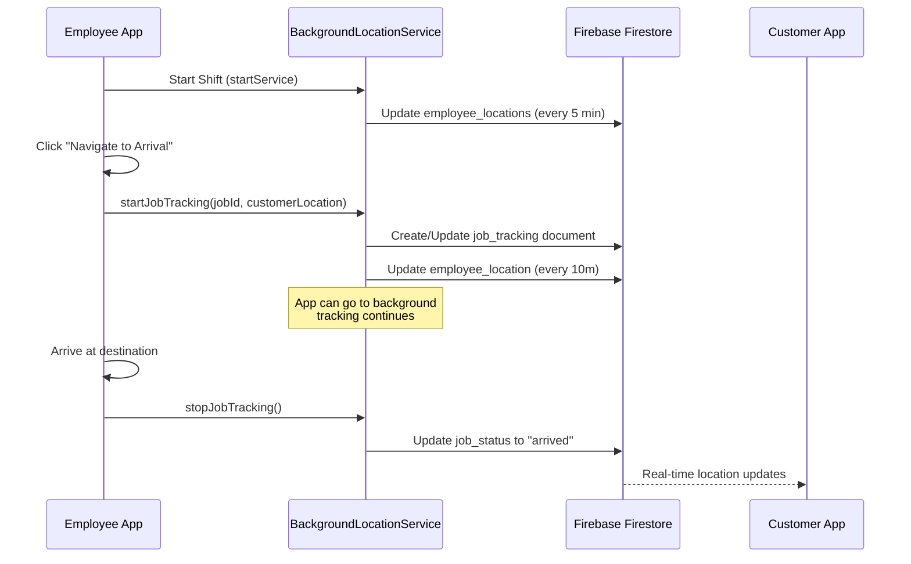

# Background Job Location Tracking - Implementation Plan

## Current Problem

Right now, GPS location sharing to Firebase only happens when the employee is on the `NavigateToJobScreen`. If they leave that screen or the app goes to background, the customer app stops receiving location updates.

## Desired Behavior

When the employee clicks "Navigate to Arrival" on the job details screen:
1. Location tracking should start immediately
2. Location should continue to be shared even if they leave the navigation screen
3. Location should continue to be shared when the app is in background
4. Tracking should stop when the employee arrives at the destination

## Current Implementation Analysis

### 1. BackgroundLocationService
- **Purpose**: General shift tracking (every 5 minutes)
- **Starts**: When employee taps "Start Shift"
- **Stops**: When employee taps "End Shift"
- **Firebase Collection**: `employee_locations`
- **Runs in background**: Yes

### 2. LocationTrackingService
- **Purpose**: Real-time job navigation tracking (every 10 meters)
- **Starts**: When `NavigateToJobScreen` initializes
- **Stops**: When employee leaves the screen or arrives
- **Firebase Collection**: `job_tracking`
- **Runs in background**: No (stops when app is backgrounded)

### 3. Job Status Flow
1. `assigned` → Employee sees "Navigate" button on JobDetailsScreen
2. `en_route` → Employee taps "Navigate", API updates status
3. `arrived` → Employee arrives at destination

## Proposed Solution

### Option A: Extend BackgroundLocationService (Recommended)

Modify `BackgroundLocationService` to handle both:
1. General shift tracking (existing - every 5 min)
2. Job-specific tracking (new - every 10 meters when navigating to a job)

#### Changes Required:

1. **BackgroundLocationService** - Add job tracking capability:
   - Add method to start job-specific tracking: `startJobTracking(jobId, customerLocation)`
   - Add method to stop job tracking: `stopJobTracking()`
   - Modify `onStart` to listen for job tracking events
   - When job tracking is active, use `Geolocator.getPositionStream()` instead of Timer
   - Update Firebase `job_tracking` collection instead of `employee_locations`

2. **JobDetailsScreen** - Modify `_handleNavigateToJob()`:
   - After successful API call to `navigateToJob()`
   - Call `BackgroundLocationService.startJobTracking(jobId, customerLocation)`
   - Then navigate to `/navigate-to-job`

3. **NavigateToJobScreen** - Simplify:
   - Remove `_startFirebaseTracking()` call from `_initializeLocation()`
   - Keep UI-related location features (map, route, etc.)
   - On arrival, call `BackgroundLocationService.stopJobTracking()`

4. **Arrival Flow** - Ensure tracking stops:
   - When employee marks arrival, stop job tracking
   - Could be in `NavigateToJobScreen._handleArrival()` or `JobVerificationScreen`

### Option B: Use SharedPreferences + Background Service

Store active job ID in SharedPreferences and check it in background service.

**Pros**: Persists across app restarts
**Cons**: More complex, need to handle cleanup

### Option C: Separate Background Job Service

Create a new `BackgroundJobTrackingService` dedicated to job tracking.

**Pros**: Clean separation of concerns
**Cons**: More code duplication, another service to manage

## Recommended Approach: Option A

### Architecture Flow



### Implementation Steps

#### Step 1: Modify BackgroundLocationService

Add the following to `BackgroundLocationService`:

```dart
// New static methods to control job tracking
static void startJobTracking({
  required int jobId,
  required double customerLat,
  required double customerLng,
}) {
  final service = FlutterBackgroundService();
  service.invoke('startJobTracking', {
    'jobId': jobId,
    'customerLat': customerLat,
    'customerLng': customerLng,
  });
}

static void stopJobTracking() {
  final service = FlutterBackgroundService();
  service.invoke('stopJobTracking');
}
```

In the `onStart` method, add event listeners:

```dart
String? currentJobId;
StreamSubscription<Position>? jobTrackingSubscription;

// Listen for job tracking start
service.on('startJobTracking').listen((event) async {
  if (event == null) return;
  
  currentJobId = event['jobId']?.toString();
  final customerLat = event['customerLat'] as double?;
  final customerLng = event['customerLng'] as double?;
  
  if (currentJobId == null) return;
  
  // Initialize job tracking document
  final docRef = firestore.collection('job_tracking').doc(currentJobId);
  await docRef.set({
    'employee_id': int.parse(employeeId!),
    'job_status': 'en_route',
    'customer_location': {
      'latitude': customerLat,
      'longitude': customerLng,
    },
    'updated_at': FieldValue.serverTimestamp(),
  }, SetOptions(merge: true));
  
  // Start position stream for real-time tracking
  jobTrackingSubscription?.cancel();
  jobTrackingSubscription = Geolocator.getPositionStream(
    locationSettings: const LocationSettings(
      accuracy: LocationAccuracy.high,
      distanceFilter: 10,
    ),
  ).listen((Position position) {
    docRef.update({
      'employee_location': {
        'latitude': position.latitude,
        'longitude': position.longitude,
        'updated_at': FieldValue.serverTimestamp(),
      },
    });
    
    // Update notification
    if (service is AndroidServiceInstance) {
      service.setForegroundNotificationInfo(
        title: "Navigating to Job #$currentJobId",
        content: "Location sharing active",
      );
    }
  });
});

// Listen for job tracking stop
service.on('stopJobTracking').listen((event) async {
  jobTrackingSubscription?.cancel();
  jobTrackingSubscription = null;
  
  if (currentJobId != null) {
    await firestore.collection('job_tracking').doc(currentJobId).update({
      'job_status': 'arrived',
      'updated_at': FieldValue.serverTimestamp(),
    });
    currentJobId = null;
  }
  
  // Reset notification
  if (service is AndroidServiceInstance) {
    service.setForegroundNotificationInfo(
      title: "DuneShine Shift Active",
      content: "Your location is being tracked while on duty",
    );
  }
});
```

#### Step 2: Modify JobDetailsScreen

Update `_handleNavigateToJob()` to start background tracking before navigating:

```dart
Future<void> _handleNavigateToJob() async {
  if (_job == null) return;

  final token = AuthService().token;
  if (token == null) {
    ToastUtils.showErrorToast(context, 'Not authenticated. Please login again.');
    return;
  }

  setState(() {
    _isNavigating = true;
  });

  final response = await ApiService().navigateToJob(
    jobId: _job!.id,
    token: token,
  );

  setState(() {
    _isNavigating = false;
  });

  if (response['success'] == true) {
    final data = response['data'] as Map<String, dynamic>;
    final jobJson = data['job'] as Map<String, dynamic>?;
    
    Job updatedJob = _job!;
    if (jobJson != null) {
      updatedJob = _job!.mergeWith(Job.fromJson(jobJson));
      setState(() {
        _job = updatedJob;
      });
    }

    // Parse customer location for tracking
    final geoStr = updatedJob.booking?.geoLocation;
    double? customerLat;
    double? customerLng;
    
    if (geoStr != null && geoStr.isNotEmpty) {
      final parts = geoStr.split(',');
      if (parts.length == 2) {
        customerLat = double.tryParse(parts[0].trim());
        customerLng = double.tryParse(parts[1].trim());
      }
    }

    // Start background job tracking
    if (customerLat != null && customerLng != null) {
      BackgroundLocationService.startJobTracking(
        jobId: updatedJob.id,
        customerLat: customerLat,
        customerLng: customerLng,
      );
    }

    // Navigate to map screen
    if (mounted) {
      // ... existing navigation code ...
      Navigator.pushNamed(
        context,
        '/navigate-to-job',
        arguments: {
          'jobId': 'JOB-${updatedJob.id}',
          // ... other arguments ...
          'job': updatedJob,
        },
      );
    }
  } else {
    if (mounted) {
      ToastUtils.showErrorToast(context, response['message'] ?? 'Failed to start navigation');
    }
  }
}
```

#### Step 3: Modify NavigateToJobScreen

Remove the Firebase tracking initialization since it's now handled by background service:

```dart
// In _initializeLocation(), remove or comment out:
// if (_job != null) {
//   _startFirebaseTracking();
// }

// Keep UI-related location updates:
// - _startPositionStream() for map updates
// - _parseCustomerLocation() for destination

// In dispose() or when arriving, stop tracking:
@override
void dispose() {
  _positionStream?.cancel();
  // Don't stop Firebase tracking here anymore
  // BackgroundLocationService.stopJobTracking(); // Remove this
  _mapController?.dispose();
  super.dispose();
}

// Stop tracking when arriving
Future<void> _handleArrival() async {
  // ... existing arrival code ...
  
  // Stop background job tracking
  BackgroundLocationService.stopJobTracking();
  
  // ... rest of arrival handling ...
}
```

#### Step 4: Handle Job Completion/Arrival

Ensure tracking stops when job is completed. This could be in:
- `NavigateToJobScreen._handleArrival()`
- `JobVerificationScreen` (when OTP is verified)

Add `BackgroundLocationService.stopJobTracking()` call.

### Firebase Data Structure

The `job_tracking` collection document will contain:

```json
{
  "employee_id": 123,
  "job_status": "en_route",
  "customer_location": {
    "latitude": 25.2048,
    "longitude": 55.2708
  },
  "employee_location": {
    "latitude": 25.2050,
    "longitude": 55.2710,
    "updated_at": "timestamp"
  },
  "created_at": "timestamp",
  "updated_at": "timestamp"
}
```

### Edge Cases to Handle

1. **App killed while navigating**: Background service should continue tracking
2. **Employee ends shift while navigating**: Stop job tracking first, then stop shift tracking
3. **Multiple jobs**: Only track the active job (current implementation assumes single active job)
4. **Location permission revoked**: Handle gracefully, stop tracking
5. **Network issues**: Firestore offline persistence should handle this

### Testing Checklist

- [ ] Start shift → Background tracking starts (every 5 min)
- [ ] Click "Navigate" → Job tracking starts (every 10m)
- [ ] Leave navigation screen → Job tracking continues
- [ ] App goes to background → Job tracking continues
- [ ] Arrive at destination → Job tracking stops
- [ ] End shift → Background tracking stops
- [ ] Customer app receives real-time updates throughout

## Files to Modify

1. `lib/services/background_location_service.dart` - Add job tracking methods
2. `lib/screens/job_details_screen.dart` - Start tracking on navigate
3. `lib/screens/navigate_to_job_screen.dart` - Remove duplicate tracking, stop on arrival
4. `lib/screens/job_verification_screen.dart` - Stop tracking on OTP verify (if needed)

## Migration Notes

- No breaking changes to existing APIs
- Existing shift tracking continues to work as before
- Job tracking is additive functionality
- Firebase collections remain the same (`job_tracking` already exists)
